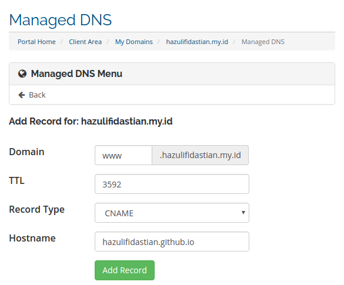
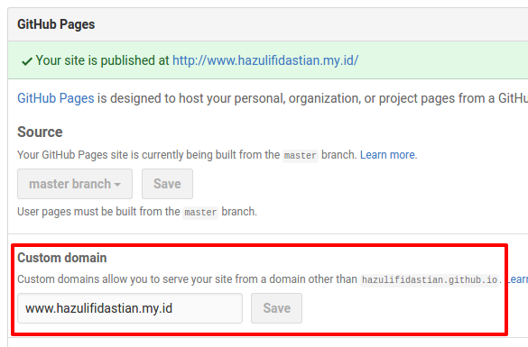

#######################
Custom Domain di Github
#######################

:date: 2017-06-28 09:00
:author: Hazuli Fidastian
:tags: github ; website
:lang: id

Setelah membuat website menggunakan Github, website bisa dibuatkan domain khusus. 
Artinya, setiap kita ingin akses ke website tidak perlu menggunakan domain standar 
bawaan dari Github hazulifidastian.github.io. Tapi bisa menggunakan alamat yang kita 
tentukan sendiri, misalnya alamat Saya ini hazulifidastian.my.id.

Memiliki domain sendiri tidaklah terlalu sulit, hanya saja kita perlu membeli domain 
tersebut. Harganya pun tidak terlalu mahal, dibayarkan pertahun. Harganya antara 50 
ribu hingga 110 ribu untuk domain my.id, web.id, .com, .net dll.

**Konfigurasi repository di Github untuk bisa menerima custom domain**

Repository website kita pada Github harus dikonfigurasi agar bisa menerima custom 
domain. Buka repository website. Jika dari contoh post Saya sebelumnya, nama repository 
website adalah hazulifidastian.github.io.

Pada halaman repository, dibawah nama repository hazulifidastian.github.io klik menu 
Settings. Menu dengan gambar gear.

Cari Custom Domain, ganti dengan nama domain yang akan digunakan. Misalnya saya 
menggunakan domain www.hazulifidastian.my.id. Setelah dirubah, simpan perubahan tersebut.

**Tambahkan record CNAME dan A di panel DNS Management**

Login di client area tempat kita membeli domain, kemudian pilih domain yang akan 
dirubah konfigurasinya. Masing-masing penyedia jasa memiliki menu yang berbeda-beda. 
Temukan menu DNS Management.

Kita perlu menambahkan 3 record untuk mengarahkan domain kita ke Github. Hasil akhir 
semua record setelah ditambahkan bisa dilihat ditable dibawah ini.

.. raw:: html

   

   <table>
   <thead>
   <tr>
   <th>Domain</th><th>TTL</th><th>Class</th><th>Type</th><th>Destination</th></tr>
   </thead>
   <tbody>
   <tr><td>www</td><td>3592</td><td>IN</td><td>CNAME</td><td>hazulifidastian.github.io</td></tr>
   <tr><td>hazulifidastian.my.id.</td><td>73</td><td>IN</td><td>A</td><td>192.30.252.153</td></tr>
   <tr><td>hazulifidastian.my.id.</td><td>73</td><td>IN</td><td>A</td><td>192.30.252.154</td></tr>
   </tbody>
   </table>
   

Setelah penambahan, jika kita mengetikkan domain kita misalnya 
www.hazulifidastian.my.id halaman website kita belum akan muncul. Karena perubahan 
DNS membutuhkan waktu untuk setiap perubahan. Lamanya tergantung dengan provider 
domain, bisa beberapa menit bahkan bisa sampai sehari.
